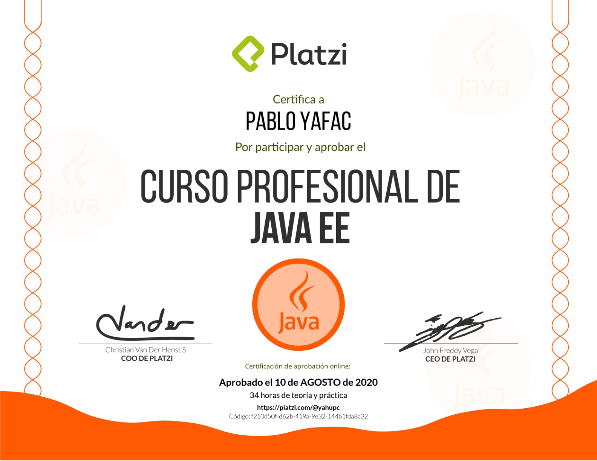
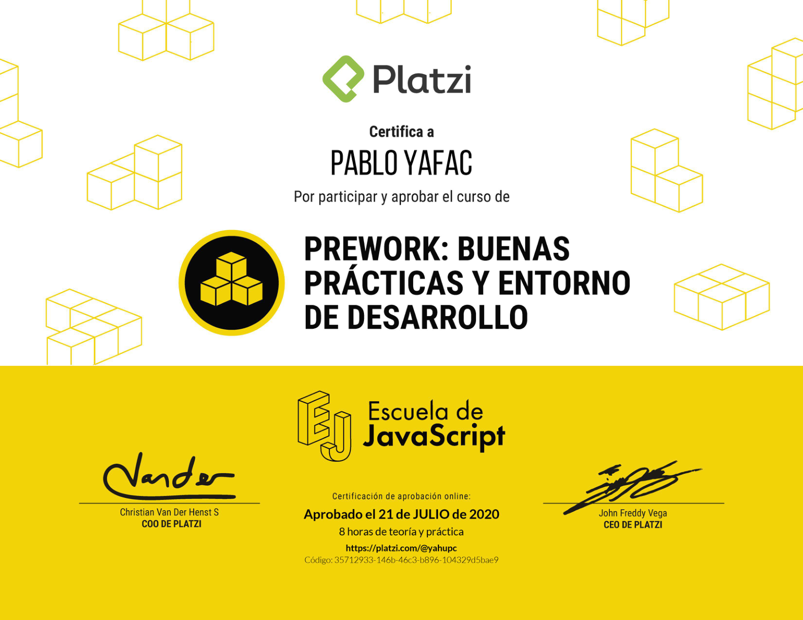
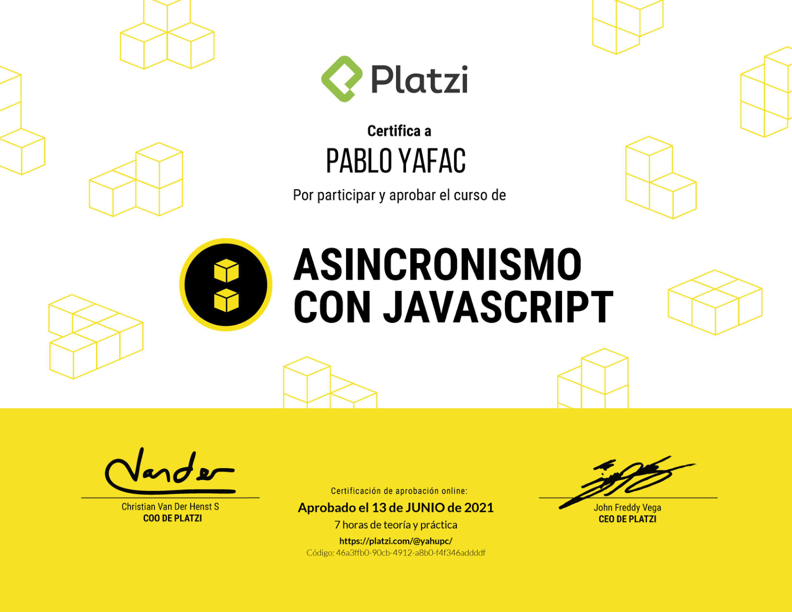

# Cursos
Lista de Curso de Desarrollo Web realizados en Platzi.
## Backend
+ diploma-intro-laravel-2020.

+ diploma-jee.

+ diploma-oop.

+ diploma-java-se.

+ diploma-java-persistencia.

+ diploma-entorno-desarrollo.

+ diploma-terminal.

## Frontend
+ diploma-vuejs2.

+ diploma-woocommerce.

+ diploma-ecmascript-6.

+ diploma-asincronismo-js.

<!-- + diploma-javascript-navegador.
 -->
+ diploma-basico-javascript.

+ diploma-html-practico.

+ diploma-html-css.

