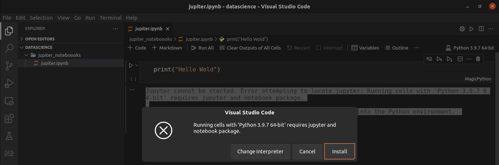

# Extensiones VSCode para analisis de datos
+ Python
+ Magic Python
+ Material Icon Theme
+ Rainbow Brackets
+ Remote Development

## Notebook dentro de VSCode
+ Crea una carpeta , añade un archivo en ella con la siguiente extension ".ipynb"
> Visual Studio Code te recomendará instalar las extensiones necesarias para ejecutar tu Jupyter Notebook.


+ Puedes obtener el mismo resultado ejecutando los siguientes comandos desde el terminal.
``` sh
pip3 install ipykernel
pip3 install jupyter
pip3 install notebook
```
> Si despues de instalar estos programas tienes problemas que no te reconoce los comnandos.
`command not found: jupyter` al ejecutar  `jupyter notebook`. Puedes utilizar el siguiente comando.

```sh
sudo -H pip install jupyter
 ```
Execute a command as another user -H
 The -H (HOME) option requests that the security policy set the HOME environment variable to the home directory of the target user (root by default) as specified by the password database. Depending on the policy, this may be the default behavior.

+ Para  comprobar que tienes instalado correctamente Jupyter ejecuta en consola el siguiente comando:
```sh
jupyter --version

# resultado (ejemplo):
Selected Jupyter core packages...
IPython          : 8.1.1
ipykernel        : 6.9.1
ipywidgets       : 7.6.5
jupyter_client   : 7.1.2
jupyter_core     : 4.9.2
jupyter_server   : 1.13.5
jupyterlab       : 3.3.0
nbclient         : 0.5.11
nbconvert        : 6.4.2
nbformat         : 5.1.3
notebook         : 6.4.8
qtconsole        : 5.2.2
traitlets        : 5.1.1

```
 >Puedes usar Jupyter Notebook fuera de Vscode con env
[How to Install Jupyter Notebook on Ubuntu 20.04 via env](https://linuxways.net/ubuntu/how-to-install-jupyter-notebook-on-ubuntu-20-04/)